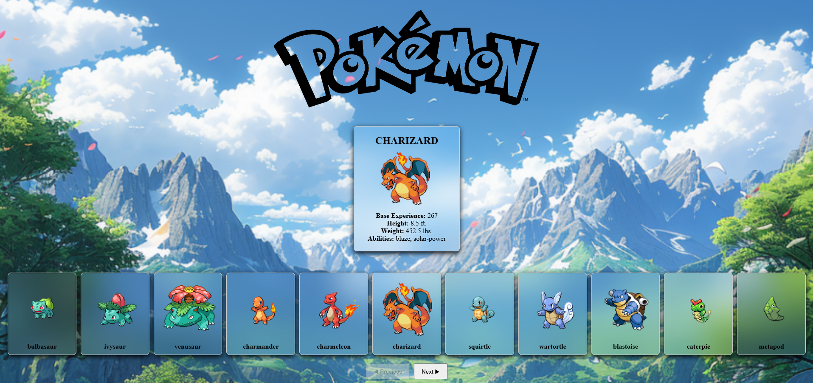

# Pokemon Viewer App

---

## Mockups



---

## Overview
This is a React-based application that fetches and displays a list of Pokémon from the PokéAPI. Users can browse through a paginated list of Pokémon and view details such as base experience, height, weight, and abilities by selecting a Pokémon.

---

## Features
- Fetches all Pokemon from the PokeAPI and displays them in a paginated list.
- Allows users to click on a Pokemon to view detailed information
- Uses React class components for state management in App.jsx
- Implements pagination for improved usability
- Styles the UI with CSS files for a clean and modern look.

---

## Component Breakdown

**CharacterList.jsx**
- Fetches Pokemon data from PokeAPI
- Displays a paginated list of Pokemon
- Allows users to select a Pokemon to view details

**CharacterDetails.jsx**
- Displays detailed information about the selected Pokemon
- Adjusts height and weight values for better proportional comparison

**App.jsx**
- Manages selected Pokemon state
- Integrated ```CharacterList``` and ```CharacterDetails``` components

**main.jsx**
- Renders the ```App``` component inside ```root``` using React's ```createRoot```

---

## Styling

**Custom styles are applied via**
- ```characterList.css``` (List view styling)
- ```characterDetails.css``` (Detail card styling)
- ```mainApp.css``` (Background and general layout styling)

---

## Technologies Used

- React.js
- Axios (for API request)
- CSS (for styling)

---

## Folder Structure
```plaintext

Project Root
├── public/
│   ├── Pokemon_scenic_valley.png
│   ├── PokemonLogo.png
├── src/
│   ├── components
│   │   ├── CharacterDetails.jsx
│   │   ├── CharacterList.jsx
│   ├── styles
│   |   ├── characterDetails.css
│   |   ├── characterList.css
│   |   ├── mainApp.css
├── App.jsx
├── main.jsx
├── index.html
├── README.md
```